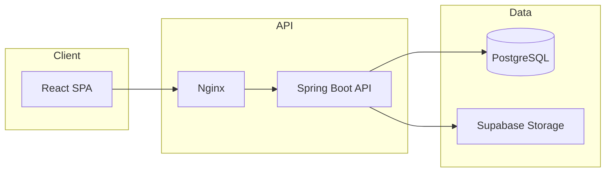

  

<h1 align="center">SnapFix</h1>

  <strong>Report campus issues. Track fixes. Earn rewards.</strong> 
  A full-stack college issue reporting and maintenance management platform.

  <a href="#project-overview">Overview</a> •
  <a href="#repository-layout">Layout</a> •
  <a href="#tech-stack">Tech Stack</a> •
  <a href="#architecture">Architecture</a> •
  <a href="#features">Features</a> •
  <a href="#screenshots">Screenshots</a> •
  <a href="#license">License</a>

---

## Project overview

**SnapFix** is a centralized hub where students, faculty, staff, and administrators collaborate to report infrastructure problems, track maintenance tickets, and resolve campus issues efficiently.

**Problem:** Traditional college maintenance relies on phone calls, informal messages, and paper trails — requests get lost, staff lack accountability, and leadership has no visibility into patterns or response times.

**Solution:** SnapFix provides digital issue reporting with photos, role-based dashboards, automated workflows, duplicate-ticket detection, email notifications, and a gamified points-and-voucher reward system to drive student engagement.

| Role | Primary use |
|------|-------------|
| **Students & faculty** | Report issues, track progress, redeem rewards |
| **Staff** | Manage assigned tickets, update status |
| **Administrators** | Assign tickets, analytics, user management |

---

## Repository layout

| Path | Purpose |
|------|---------|
| `backend/` | Spring Boot REST API — auth, tickets, rewards, file uploads |
| `frontend/` | React + TypeScript SPA — role-based dashboards and workflows |
| `database/` | PostgreSQL schema and migrations |
| `deployment/` | Docker Compose, Nginx, Kubernetes manifests |
| `db-dashboard/` | Optional database monitoring UI |
| `docs/screenshots/` | Product branding and UI captures |

---

## Tech stack

| Layer | Technologies |
|-------|----------------|
| **Frontend** | React 19, TypeScript, Tailwind CSS, React Router, Axios, Chart.js, Framer Motion |
| **Backend** | Java 17, Spring Boot 3, Spring Security, Spring Data JPA, JWT |
| **Database** | PostgreSQL 15 |
| **Storage** | Supabase (image uploads) |
| **Email** | Spring Mail (SMTP notifications) |
| **DevOps** | Docker, Docker Compose, Nginx, Kubernetes |

---

## Architecture

### Request flow (simplified)

| Step | Flow |
|------|------|
| **Auth** | Login → JWT issued → protected routes by role |
| **Ticket** | Student submits issue + photo → duplicate check → ticket created → staff notified |
| **Resolution** | Staff updates status → points awarded → email alerts |
| **Rewards** | Points accumulated → voucher redemption with QR codes |

---

## Features

### Issue reporting
- Photo uploads along with category, priority, and location
- Duplicate / similar-ticket detection before submission
- Auto-generated ticket IDs and status lifecycle

### Role-based access
- Separate dashboards for student, staff, admin, and department head
- JWT stateless authentication with Spring Security RBAC

### Maintenance workflow
- Ticket assignment, comments, and status tracking
- Analytics dashboard with Chart.js visualizations
- Email notifications on key events

### Rewards system
- Points for reporting and resolution milestones
- Voucher catalog and QR-based redemption
- Leaderboard and reward statistics

---

## Screenshots

  
   
  <em>Brand identity — login and app chrome</em>

  
   
  <em>App icon / mark</em>

> Add `docs/screenshots/login-hero.png` and `docs/screenshots/admin-dashboard.png` for full UI captures on the public mirror.

---

## License

Private / all rights reserved. This repository is a portfolio snapshot; source is not licensed for redistribution or commercial use without permission.
